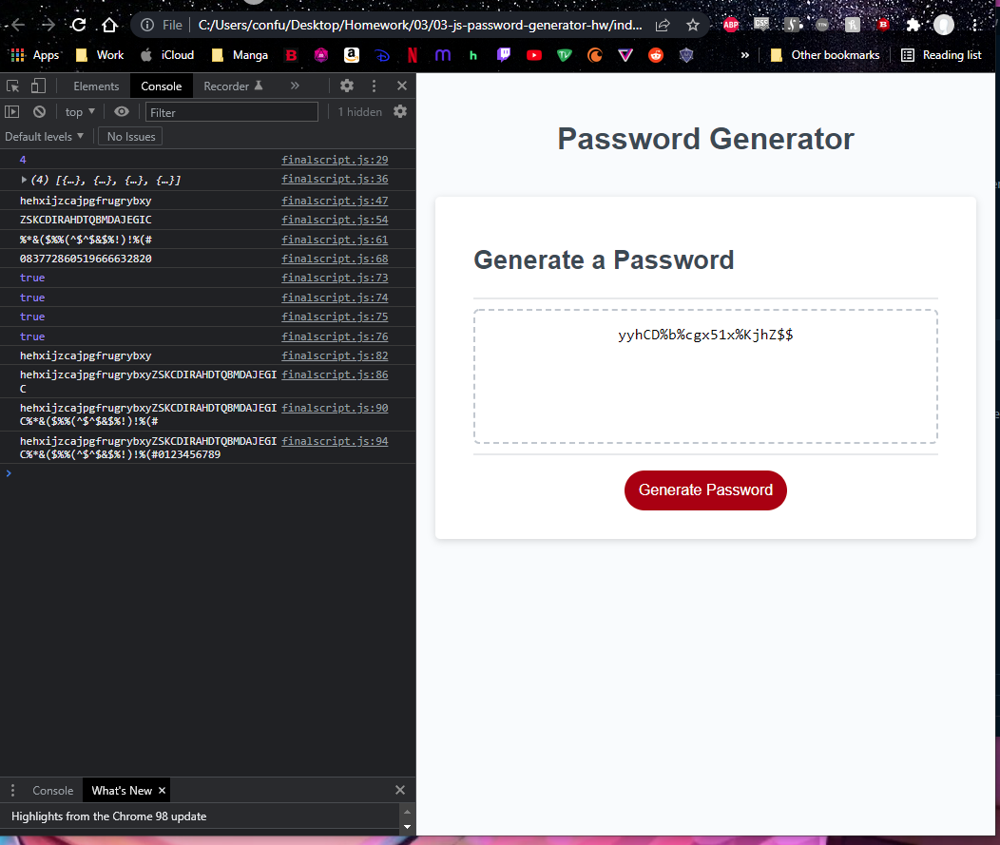

# 03-js-password-generator-project

WEEE this is a password generator project. index.html, style.css, and part of the original javascript was provided. In this finalscript.js I used Math.floor(Math.random()) to create random strings and used the .splitsring method to randomly assign letters. The user is prompted for the length and type of characters they want and the button magicly generates a password.

[Link to final project webpage](https://confusedicarus.github.io/03-js-password-generator-project/)
